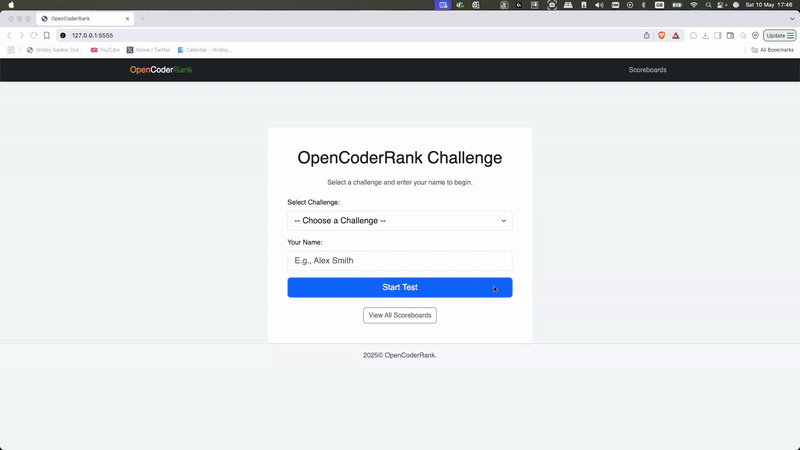

# OpenCoderRank: In-House Coding Interview Platform

<!-- Example Badges (add your own actual badges for CI, coverage, etc.) -->
<!-- [](https://travis-ci.org/yourusername/OpenCoderRank) -->
<!-- [](https://coveralls.io/github/yourusername/OpenCoderRank) -->
[](https://opensource.org/licenses/MIT) <!-- Add a LICENSE.md file with MIT license text -->

OpenCoderRank is a lightweight yet powerful web platform tailored for rapid deployment and seamless management of SQL and Python coding challenges. Designed with clubs, academic groups and hackathons in mind, it provides an intuitive interface to host custom coding contests, assess participants' solutions in real time and streamline evaluation with minimal setup. Whether you're running a weekend coding sprint or preparing for inter-college competitions, OpenCoderRank delivers a fast, flexible and reliable environment to engage and evaluate developers efficiently.


## ✨ Features

*   **Multi-language & Type Support:** Currently supports SQL (SQLite dialect), Python 3, and Multiple Choice Question (MCQ) challenges.
*   **Question Variety:**
    *   Standard SQL and Python coding problems.
    *   SQL "Fix the Query" tasks where users debug/correct provided SQL.
    *   Theory-based MCQs with options.
*   **Challenge-based Testing:** Group questions into distinct challenges (e.g., "SQL Basics", "Python Advanced Problems", "Theory Concepts").
*   **Interactive Test Interface:**
    *   **Dynamic Question Loading:** Questions are fetched asynchronously for a smooth user experience.
    *   **Question Navigation Panel (QNP):** Visual panel showing question numbers, color-coded by status (Correct, Incorrect, Unattempted). Allows users to jump to any question.
    *   **Question Remarks:** Display optional hints or context (e.g., "Asked in Google 2025 interview") for each question.
*   **Paste Prevention:** Code editor disables pasting to encourage original problem-solving during assessments.
*   **Code & Answer Evaluation:**
    *   **SQL:** Executes user queries against a predefined schema and compares the output with the expected result set. Handles standard and "fix the query" types.
    *   **Python:** Runs user-submitted Python functions against a series of test cases in a basic sandboxed environment (using `subprocess`).
    *   **MCQ:** Compares user's selected option against the correct answer.
*   **Session Management:** Tracks candidate's name, selected challenge, current question, score, answers, question statuses, and test timing.
*   **Scoreboard:** Displays top scores for each challenge, ranked by score and then by time taken.
*   **Easy Setup:** Minimal dependencies (Flask and Python).
*   **Customizable:** Easily add new questions (including MCQs, SQL fix-it) and challenges by modifying Python data structures. Add remarks to questions.
*   **User-Friendly Interface:** Built with Bootstrap for a responsive design and CodeMirror for an enhanced code editing experience with syntax highlighting.
*   **CLI for DB Initialization:** Includes a Flask CLI command to set up the database schema.
*   **Full-Screen Enforcement:** The platform runs only in full-screen mode to minimize distractions and prevent task-switching.

## 🚀 Getting Started

### Prerequisites

*   Python 3.7 or higher installed on your system.
*   `pip` (Python package installer), usually comes with Python.
*   A code editor (e.g., VS Code, PyCharm, Sublime Text).
*   Git (for cloning the repository).

### Installation & Setup

1.  **Clone the Repository:**
    ```bash
    git clone https://github.com/your-username/OpenCoderRank.git # Replace with your repository URL
    cd OpenCoderRank
    ```

2.  **Create a Virtual Environment (Recommended):**
    This helps manage project dependencies in isolation.
    ```bash
    python -m venv venv
    ```
    Activate the virtual environment:
    *   On macOS and Linux:
        ```bash
        source venv/bin/activate
        ```
    *   On Windows:
        ```bash
        venv\Scripts\activate
        ```

3.  **Install Dependencies:**
    The primary dependency is Flask.
    ```bash
    pip install flask
    ```
    *(For a more robust project, consider creating a `requirements.txt` file: `pip freeze > requirements.txt` after installing dependencies, and then new users can run `pip install -r requirements.txt`)*

4.  **Create `schema.sql`:**
    This file defines the structure for the `scoreboard` database. Create a file named `schema.sql` in the root of your project directory (e.g., `OpenCoderRank/schema.sql`) with the following content:
    ```sql
    -- schema.sql
    DROP TABLE IF EXISTS scoreboard; -- Ensures a clean slate if re-initializing

    CREATE TABLE scoreboard (
        id INTEGER PRIMARY KEY AUTOINCREMENT,
        username TEXT NOT NULL,
        challenge_id TEXT NOT NULL, -- To associate score with a specific challenge
        score INTEGER NOT NULL,
        time_taken_seconds REAL NOT NULL,
        timestamp DATETIME DEFAULT CURRENT_TIMESTAMP -- When the test was completed
    );
    ```

5.  **Initialize the Database:**
    Run the following Flask CLI command from your terminal (ensure you are in the project's root directory and your virtual environment is activated):
    ```bash
    flask initdb
    ```
    This will create an SQLite database file (e.g., `scoreboard.db`) and set up the necessary tables based on `schema.sql`.
    Alternatively, the application will attempt to create and initialize the database on its first run if `scoreboard.db` doesn't exist and `schema.sql` is present.

6.  **Run the Application:**
    Start the Flask development server:
    ```bash
    python app.py
    ```
    The application will typically be available at `http://127.0.0.1:5555/` (as configured in `app.py`). Access it through your web browser.

## 📁 Project Structure

```
OpenCoderRank/
├── app.py                  # Main Flask application: routes, views, core logic
├── questions_data.py       # Stores question definitions for all challenges
├── schema.sql              # SQL schema for the scoreboard database
├── scoreboard.db           # SQLite database file (created after initdb or first run)
├── static/
│   ├── css/
│   │   └── style.css       # Custom stylesheets (currently basic)
│   └── js/
│       └── script.js       # Client-side JavaScript for the test page (handles question loading, code submission, timers, etc.)
├── templates/
│   ├── layout.html         # Base HTML template (navbar, footer, common structure)
│   ├── index.html          # Homepage: user name input and challenge selection
│   ├── test.html           # Main coding test interface
│   ├── scoreboard.html     # Displays scoreboard for a specific challenge
│   └── scoreboards_list.html # Page listing all available challenge scoreboards
├── .gitignore              # (Recommended) Specifies intentionally untracked files (e.g., venv, __pycache__)
├── LICENSE.md              # (Recommended) Your open source license file (e.g., MIT License)
└── README.md               # This file: project overview and instructions
```
*(Note: `static/js/script.js` was referenced in the HTML. Ensure it exists and contains the necessary client-side logic for the test page to function correctly.)*

## 🛠️ Usage

1.  Open your web browser and navigate to the application URL (e.g., `http://127.0.0.1:5555/`).
2.  On the homepage, enter your name and select a coding challenge from the dropdown list.
3.  Click "Start Test" to begin.
4.  The test page will load the first question. Read the description, write your code in the provided editor (SQL or Python based on the question).
    *   For SQL questions, a schema might be provided.
    *   For Python questions, starter code might be available.
5.  Click "Run Code" to evaluate your solution. Output and test case results will be displayed.
6.  If your answer is correct, or if you wish to move on, click "Next Question".
7.  Once all questions are attempted or you click "Finish Test" (if available after the last question), your test is completed.
8.  You'll be shown your final score and total time, with a link to the challenge's scoreboard.
9.  You can view all scoreboards from the "Scoreboards" link in the navigation bar or on the homepage.

## ➕ Adding Questions & Challenges

### Adding/Modifying Challenges

Challenges are defined in the `CHALLENGES` dictionary at the top of `app.py`.
To add a new challenge:
1.  Add a new key-value pair to the `CHALLENGES` dictionary. The key is the `challenge_id`.
    ```python
    # In app.py
    CHALLENGES = {
        "sql_basics": {
            "id": "sql_basics",
            "name": "SQL Basics",
            "description": "A collection of fundamental SQL questions.",
        },
        # ... other challenges ...
        "new_custom_challenge": { # Unique ID for the challenge
            "id": "new_custom_challenge",
            "name": "My Custom Challenge", # Display name
            "description": "A set of interesting problems for X skill."
        }
    }
    ```

### Adding/Modifying Questions

Questions are defined in the `QUESTIONS` list within `questions_data.py`.
To add a new question:
1.  Navigate to `questions_data.py`.
2.  Append a new dictionary to the `QUESTIONS` list.
3.  Ensure the `challenge_id` in the new question dictionary matches one of the `id`s defined in the `CHALLENGES` dictionary in `app.py`.
4.  Follow the existing structure for question dictionaries:
    *   `id`: (Integer) A globally unique identifier for the question.
    *   `challenge_id`: (String) The ID of the challenge this question belongs to.
    *   `title`: (String) The title of the question.
    *   `level`: (String) Difficulty level (e.g., "Easy", "Medium", "Hard").
    *   `language`: (String) `"sql"` or `"python"`.
    *   `description`: (String) The problem statement.
    *   `points`: (Integer) Points awarded for correctly answering the question.
    *   `time_limit_seconds`: (Integer) Indicative time limit (currently displayed, not strictly enforced by backend to stop submission yet).
    *   **For SQL questions:**
        *   `schema`: (String) SQL DDL and DML statements to create tables and insert initial data required for the question.
        *   `expected_query_output`: (String) The SQL query whose result set is considered the correct answer. The user's query output will be compared against this.
    *   **For Python questions:**
        *   `starter_code`: (String) Boilerplate Python code provided to the user.
        *   `test_cases`: (List of Dictionaries) Each dictionary represents a test case:
            *   `input_args`: (List) A list of arguments to pass to the user's function.
            *   `expected_output`: The expected return value from the user's function for the given inputs.
            *   `name`: (String, optional) A descriptive name for the test case.

Example of adding a Python question:
```python
# In questions_data.py
QUESTIONS.append({
    "id": 6, # Ensure this ID is unique
    "challenge_id": "python_advanced_problems", # Assign to an existing challenge
    "title": "Sum of Two Numbers",
    "level": "Easy",
    "language": "python",
    "description": "Write a Python function `sum_two(a, b)` that returns the sum of two numbers.",
    "starter_code": "def sum_two(a, b):\n    # Your code here\n    pass",
    "test_cases": [
        {"input_args": [1, 2], "expected_output": 3, "name": "Positive numbers"},
        {"input_args": [-1, 1], "expected_output": 0, "name": "Negative and positive"},
        {"input_args": [0, 0], "expected_output": 0, "name": "Zeros"},
    ],
    "points": 10,
    "time_limit_seconds": 180
})
```

## 🤝 Contributing

Contributions are highly welcome and appreciated! If you'd like to contribute to OpenCoderRank:

1.  **Fork the repository** on GitHub.
2.  **Clone your fork** locally: `git clone https://github.com/your-username/OpenCoderRank.git`
3.  **Create a new branch** for your feature or bug fix: `git checkout -b feature/your-amazing-feature` or `bugfix/issue-tracker-fix`.
4.  **Make your changes.** Write clean, commented code.
5.  **Test your changes** thoroughly.
6.  **Commit your changes** with a clear and descriptive commit message: `git commit -m "Add feature: XYZ"`.
7.  **Push your changes** to your fork: `git push origin feature/your-amazing-feature`.
8.  **Open a Pull Request** against the `main` branch of the original OpenCoderRank repository.

Please ensure your code adheres to the existing style and that you've added comments where necessary. If you're introducing new features, consider adding or updating documentation.

## 📝 License

This project is licensed under the MIT License. You should create a `LICENSE.md` file in the root of the project and paste the full MIT License text into it.
You can find the MIT License text here: [https://opensource.org/licenses/MIT](https://opensource.org/licenses/MIT)
